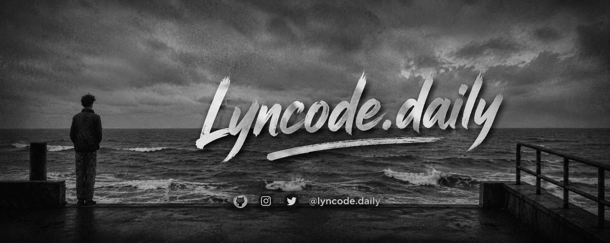

<div align="center">

<a href="https://github.com/4shiesyntax">
<<<<<<< HEAD
  
</a>

<br/>
<br/>

<h1>Lyncode.daily</h1>


</div>

<br/>

## `~/whoami`

```txt
Name     : Lyncode.daily
Focus    : Fullstack Development
Style    : Black & Lime Minimalist
Stack    : React · Tailwind · Node.js · Python
Status   : Building projects daily
Email    : hello@lincode.daily
```

<br/>

## `~/stack`
=======
  
</a>

<h1>Hi, I'm Lyncode.daily 👋</h1>

<p>
  Full-stack developer building clean, modern experiences with a minimalist black & lime style.
</p>


</div>

## About me

- Passionate about crafting useful products and polished interfaces.
- Focused on modern frontend, backend logic, and smooth developer experience.
- Enjoy turning ideas into clean, scalable solutions.

## Tech stack
>>>>>>> 4d4c52a (Improve README design)

<div align="center">


</div>

<<<<<<< HEAD
<br/>

## `~/stats`
=======
## Current focus

- Building practical projects and UI systems.
- Improving performance and maintainability.
- Exploring modern web workflows and automation.

## GitHub stats
>>>>>>> 4d4c52a (Improve README design)

<div align="center">


</div>

<<<<<<< HEAD
<br/>

## `~/activity`


<br/>

## `~/connect`
=======
## Activity


## Connect
>>>>>>> 4d4c52a (Improve README design)

<div align="center">

<a href="mailto:hello@lincode.daily">
  
</a>

<a href="https://github.com/4shiesyntax">
  
</a>

</div>

<<<<<<< HEAD
<br/>

<div align="center">

```txt
[ black & lime — always minimal, always building ]
```
=======
<div align="center">

<p><strong>black & lime — always minimal, always building</strong></p>
>>>>>>> 4d4c52a (Improve README design)


</div>
